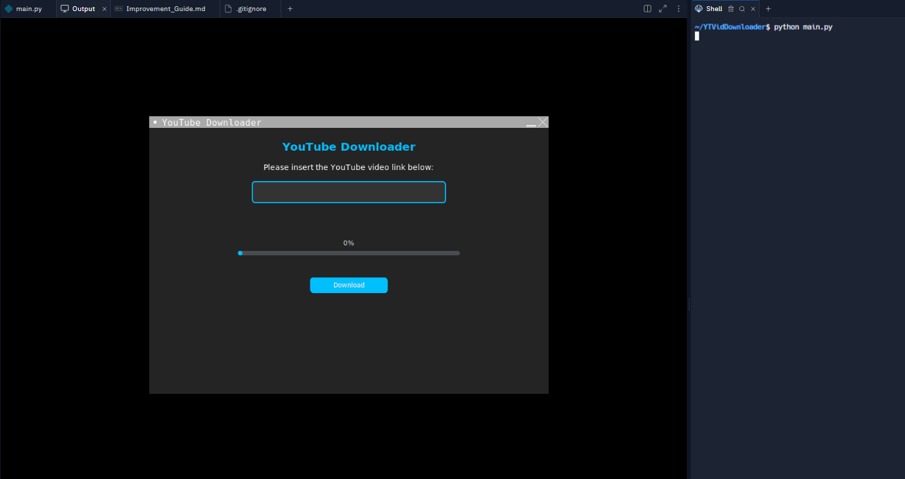

# YouTube Downloader

This YouTube Downloader application allows you to easily download videos from YouTube.

This application is built using Python and a graphical user interface (GUI) for ease of use. You simply need to enter the YouTube video link, and the app will handle the rest.


<p align="center">
*UI may look outdated because I was using a virtual machine (VM) during the demonstration.*
</p>

<p align="center">
<strong>For the latest updates and improvements, please read the <a href="Updates_and_Improvements.md">Updates and Improvements</a> document.</strong>
</p>

## Requirements

Before you start, you need to have Python installed on your computer. If you don’t have it yet, you can download it from [python.org](https://www.python.org/downloads/).

If you're new to Python, watch this video to learn how to download and install it, [Watch this video](https://www.youtube.com/watch?v=nU2Egc3Zx3Q) to get started!


### Installing Dependencies

1. **Download the Project:**
   - To get started, you need to download the project files. You can either:
     - Click on the "Download" button if available.
     - Clone the repository using Git by running the following command in your terminal:
       ```bash
       git clone <repository-url>
       ```
     - Replace `<repository-url>` with the actual URL of the project repository.

2. **Open a Terminal/Command Prompt:**
   - After downloading the project, you need to open a terminal (on macOS/Linux) or Command Prompt (on Windows).
   - To navigate to the folder where you downloaded the project, use the `cd` (change directory) command. For example:
     ```bash
     cd path/to/your/project-folder
     ```
   - Replace `path/to/your/project-folder` with the actual path where you saved the project.

3. **Install Required Libraries:**
   - The project relies on specific Python libraries to function correctly. You can install these libraries using `pip`, which is Python's package installer.
   - Run the following command in the terminal:
     ```bash
     pip install -r requirements.txt
     ```
   - This command looks for a file named `requirements.txt` in your project folder, which contains a list of necessary libraries, including `yt-dlp` (for downloading videos) and `customtkinter` (for creating the graphical user interface).

## How to Run the Application

1. **Open the Project Folder:**
   - Make sure you are still in the project folder in your terminal or Command Prompt. You can check your current directory by running:
     ```bash
     pwd  # For macOS/Linux
     ```
     ```bash
     cd  # For Windows
     ```

2. **Run the Application:**
   - To start the YouTube Downloader application, execute the following command:
     ```bash
     python main.py
     ```
   - This command tells Python to run the `main.py` file, which contains the application's code.

3. **Using the Application:**
   - Once the application opens, you will see a graphical user interface (GUI) with a text box.
   - In this text box, paste the YouTube video link you wish to download. Make sure the link starts with `https://` (e.g., `https://www.youtube.com/watch?v=video_id`).
   - After entering the link, click the "Download" button.

4. **Check the Download Status:**
   - The application will display the progress of the download in the GUI. You will see messages indicating how much of the video has been downloaded.
   - Once the download is complete, a message will appear confirming the successful download.

## Exporting Files

- The downloaded video will be saved in the same folder where the application is located. The video will be named according to its title on YouTube, with the appropriate file extension (e.g., `.mp4`).

## Troubleshooting

- **If you encounter errors:**
  - **Invalid Video URL:** Ensure the video URL is correct and starts with `https://www.youtube.com/`. If it's a different format, the application may not recognize it.
  - **Internet Connection Issues:** Check your internet connection to ensure it's stable and functioning.
  - **Application Crashes:** If the application closes unexpectedly, note any error messages displayed. These can help identify the problem. You can also refer to the documentation or seek help from the community.
  
- **Need Further Assistance?** If you're still having issues, please create an issue in my repository, and I will be happy to help you troubleshoot.


## Additional Notes

- This application is intended for educational purposes only. It does not allow the downloading of copyrighted content without proper authorization. Please ensure you have the right to download any video before using this application.
- Use this tool responsibly and adhere to YouTube's Terms of Service. Always respect the rights of content creators.

## License

This project is licensed under the MIT License. Feel free to modify and use it as needed.

